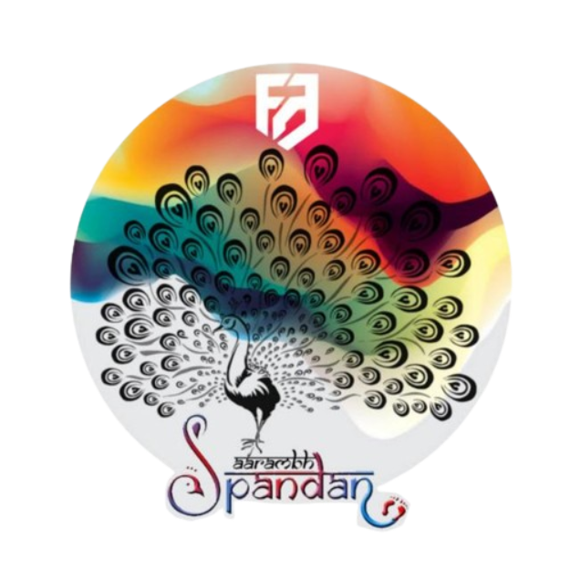

<div align="center">



# ✨ SPANDAN — Fine Arts Community

**A full-stack web platform for the Spandan Fine Arts Community**  
Celebrating creativity through Rangoli, Painting, Mehendi, Sketching, Clay Art, Face Painting & more.

[](https://reactjs.org/)
[](https://tailwindcss.com/)
[](https://supabase.com/)
[](https://www.framer.com/motion/)
[](https://cloudinary.com/)

</div>

---

## 🎨 Overview

**Spandan** is the official Fine Arts Community platform of BBDNIIT. This website serves as the digital home for the community — showcasing events, gallery, committee members, student coordinators, and allowing students to register for art events.

The platform includes a fully-featured **Admin CMS** for managing all content without touching code.

---

## 🖼️ Features

### Public Site
- **Hero / About** — Animated landing section with community introduction and art category tags
- **Roles & Responsibilities** — Showcases what the community offers
- **Committee Structure** — Convenor, Organizational Members, and year-wise Student Coordinators
- **Event Gallery** — Filterable photo gallery organized by event and year
- **Event Registration** — Students can register for fine arts events
- **Videos Section** — Curated YouTube videos with auto-thumbnails
- **Floating Art Elements** — Animated background with fine arts icons (brush, palette, easel, quill, rangoli, etc.)
- **Cursor Glow** — Custom cursor glow effect
- **Floating Social Icon** — Quick Instagram access

### Admin CMS (`/admin`)
- **Dashboard** — Overview stats
- **Gallery Manager** — Bulk image upload with drag & drop, event filtering, year filtering
- **Event Manager** — Add/edit/delete events with thumbnail upload
- **Teacher Manager** — Manage committee members (Convenor + Organizational Members)
- **Coordinator Manager** — Year-wise student coordinators with photo, college & branch
- **Video Manager** — YouTube video management with auto-thumbnail preview
- **Registrations Manager** — View, search, filter, sort and export registrations to Excel/CSV
- **Site Content Manager** — Edit section headings and descriptions live
- **Confirm Dialog** — Portal-based delete confirmation (no scroll issues)

---

## 🛠️ Tech Stack

| Layer | Technology |
|---|---|
| Frontend | React 18, Tailwind CSS 3 |
| Animations | Framer Motion 11 |
| Backend / DB | Supabase (PostgreSQL + Auth) |
| Media Storage | Cloudinary |
| Icons | React Icons (Feather, Font Awesome) |
| Export | SheetJS (xlsx) |
| Charts | Recharts |

---

## 🗄️ Database Schema (Supabase)

```sql
-- Events
create table events (
  id uuid default gen_random_uuid() primary key,
  title text not null,
  description text,
  thumbnail_url text,
  year text,
  created_at timestamptz default now()
);

-- Gallery
create table gallery (
  id uuid default gen_random_uuid() primary key,
  title text,
  description text,
  event_category text,
  year text,
  image_url text,
  created_at timestamptz default now()
);

-- Teachers (Committee)
create table teachers (
  id uuid default gen_random_uuid() primary key,
  name text not null,
  role text not null,
  bio text,
  image_url text,
  created_at timestamptz default now()
);

-- Coordinators
create table coordinators (
  id uuid default gen_random_uuid() primary key,
  name text not null,
  year text not null,
  college text,
  branch text,
  image_url text,
  created_at timestamptz default now()
);

-- Videos
create table videos (
  id uuid default gen_random_uuid() primary key,
  title text not null,
  description text,
  youtube_url text not null,
  thumbnail_url text,
  created_at timestamptz default now()
);

-- Registrations
create table registrations (
  id uuid default gen_random_uuid() primary key,
  name text,
  email text,
  phone text,
  roll_no text,
  branch text,
  course text,
  year text,
  art_form text,
  created_at timestamptz default now()
);

-- Site Content
create table site_content (
  id uuid default gen_random_uuid() primary key,
  key text unique not null,
  title text,
  subtitle text
);
```

---

## 🚀 Getting Started

### Prerequisites
- Node.js 18+
- A [Supabase](https://supabase.com/) project
- A [Cloudinary](https://cloudinary.com/) account

### Installation

```bash
# Clone the repository
git clone https://github.com/0609Abhinav/spandan-website.git
cd spandan-website

# Install dependencies
npm install
```

### Environment Variables

Create a `.env` file in the root (see `.env.example`):

```env
REACT_APP_SUPABASE_URL=your_supabase_project_url
REACT_APP_SUPABASE_ANON_KEY=your_supabase_anon_key
REACT_APP_CLOUDINARY_CLOUD_NAME=your_cloudinary_cloud_name
REACT_APP_CLOUDINARY_UPLOAD_PRESET=your_upload_preset
```

### Run Locally

```bash
npm start
```

Open [http://localhost:3000](http://localhost:3000) in your browser.

### Build for Production

```bash
npm run build
```

---

## 📁 Project Structure

```
spandan-website/
├── public/
│   └── index.html
├── src/
│   ├── admin/                    # Admin CMS components
│   │   ├── AdminApp.js
│   │   ├── Dashboard.js
│   │   ├── GalleryManager.js
│   │   ├── EventManager.js
│   │   ├── TeacherManager.js
│   │   ├── CoordinatorManager.js
│   │   ├── VideoManager.js
│   │   ├── RegistrationsManager.js
│   │   ├── ContentManager.js
│   │   └── ConfirmDialog.js
│   ├── components/               # Public site components
│   │   ├── AboutUs/
│   │   ├── CommitteeStructure/
│   │   ├── EventGallery/
│   │   ├── Register/
│   │   ├── roles/
│   │   ├── Footer/
│   │   ├── FloatingSocialIcon/
│   │   ├── ArtFloatingElements.js
│   │   └── CursorGlow.js
│   ├── lib/                      # Supabase, Cloudinary, Context
│   ├── assets/                   # Images and static assets
│   ├── App.js
│   └── index.js
└── package.json
```

---

## 🔐 Admin Access

Navigate to `/admin` to access the CMS. Authentication is handled via Supabase Auth.

---

## 📸 Art Forms Supported

`Rangoli` · `Painting` · `Mehendi` · `Sketching` · `Clay Art` · `Tattoo Making` · `Face Painting` · `Collage Making` · `Design Through Paper` · `Best Out of Waste`

---

## 👨‍💻 Author

**Abhinav** — [github.com/0609Abhinav](https://github.com/0609Abhinav)

---

<div align="center">
  <sub>Made with ❤️ for the Spandan Fine Arts Community · BBDNIIT</sub>
</div>
